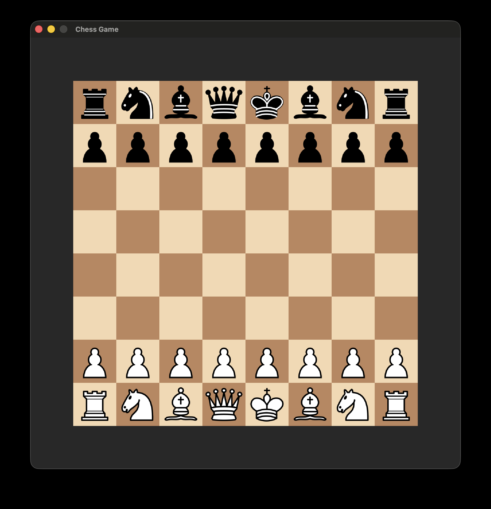
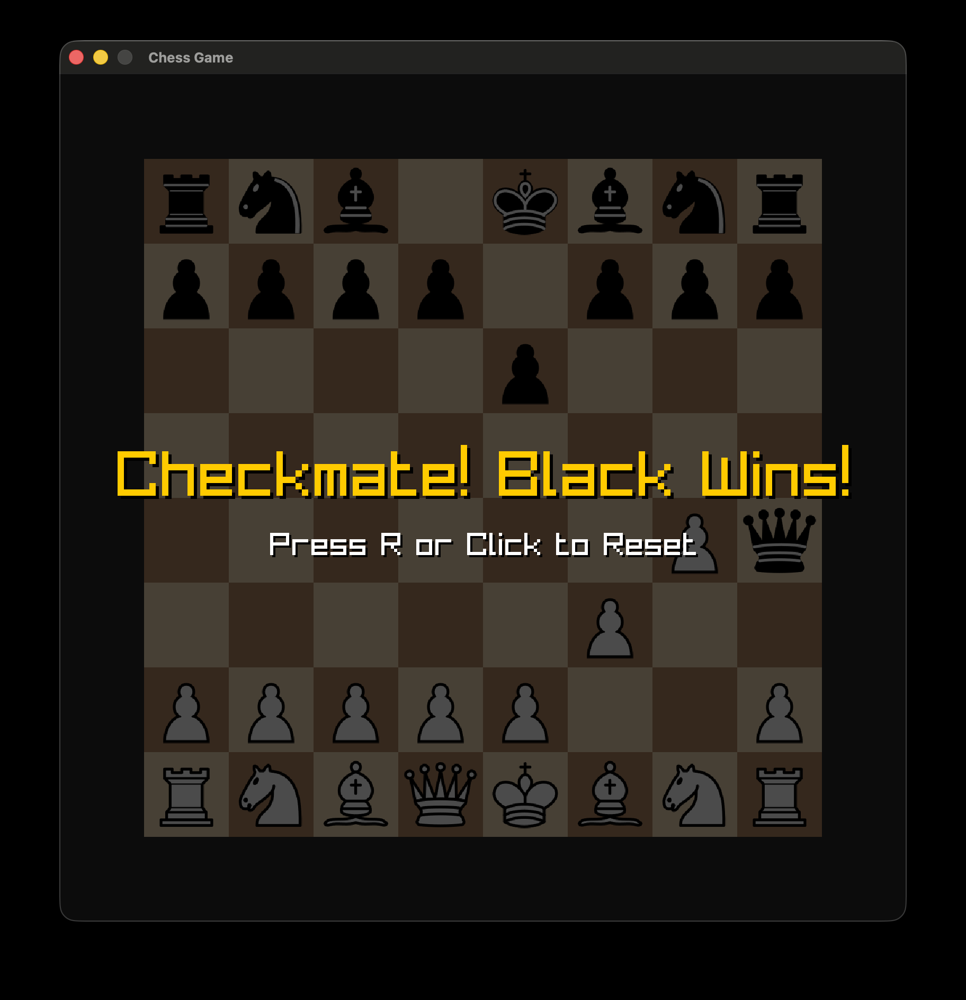
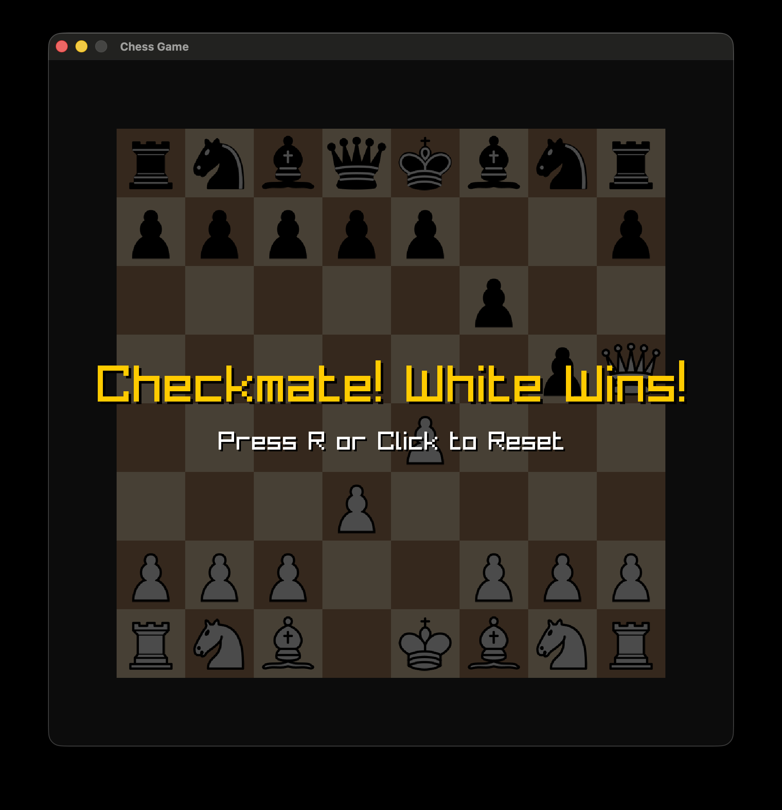

# Chess Game

A simple chess game implemented in Zig using the Raylib library for graphics rendering.

## Overview

|                      |                           |                           |
| -------------------- | ------------------------- | ------------------------- |
|  |  |  |

## Features

- Play against another player on the same machine.
- Basic move validation.
- Visual representation of the chessboard and pieces.
- Highlighting of selected pieces and possible moves.
- Check and checkmate detection.

## Requirements

- Zig programming language (version 0.15.1 or later)
- Raylib library (version 5.6.0-dev or later)

## Building and Running

1. Clone the repository:

   ```bash
    git clone https://github.com/burakssen/chess
    cd chess
   ```

2. Build the project using Zig's build system:

   ```bash
   zig build
   ```

3. Run the compiled executable:
   ```bash
   ./zig-out/bin/chess
   ```

## Controls

- Click on a piece to drag and move it to a valid square.
- The game will automatically switch turns between players.
- The game will give visual feedback for check and checkmate situations.

## License

This project is licensed under the MIT License. See the [LICENSE](./LICENSE) file for details.
